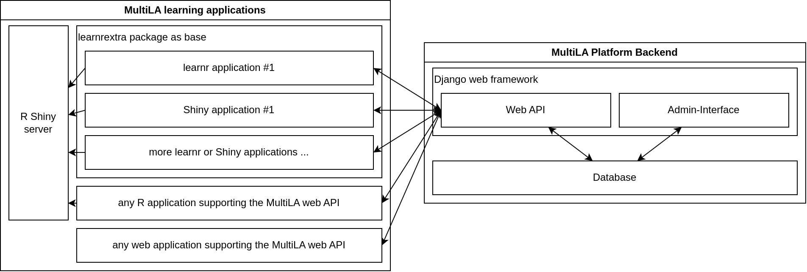

.. _devguide:

Extending the MultiLA software platform
=======================================

This part of the documentation represents the development guide for all components of the MultiLA software platform. The chapter starts with an overview of the components and how they communicate with each other. Then, development and deployment of the different components is discussed.

Overview of the software components
-----------------------------------

The following image show an overview of the MultiLA platform components:

- the web API is central and provides a common platform for setting up client applications, configuring and sharing them, and tracking user data and feedback
- all data – user generated or operational – is stored in the database

  - only the web API service has direct access to the database – client applications cannot access the database directly

- for *learnr* and Shiny based client applications, there is a package *learnrextra* that provides all necessary (JavaScript) code to interact with the web API and to make client applications *configurable*

  - this allows to quickly create several client applications that share the same code for interfacing with the web API and that can be configured in some details (e.g. including/excluding certain sections, aesthetic changes, etc.)

- the R Shiny server doesn't communicate with the MultiLA web API, only the JavaScript code on the client side implements the communication
- in general, any (web) application can use the MultiLA web API, which means for example R Shiny applications or Jupyter Notebook applications
- it is possible to connect external services for authentication (e.g. Moodle)

Code repositories overview
^^^^^^^^^^^^^^^^^^^^^^^^^^

- Web API and database: `<https://github.com/IFAFMultiLA/webapi>`_
- *learnrextra* R package: `<https://github.com/IFAFMultiLA/learnrextra>`_
- learning applications (using *learnrextra*):

  - TestgenauigkeitBayes (Bayes' Theorem applied to medical testing): `<https://github.com/IFAFMultiLA/TestgenauigkeitBayes>`_
  - Wahrscheinlichkeitsverteilungen (probability distributions): `<https://github.com/IFAFMultiLA/Wahrscheinlichkeitsverteilungen>`_
  - basic learnrextra test application in RMarkdown/learnr  `<https://github.com/IFAFMultiLA/learnrextra_testapp>`_
  - basic learnrextra test application in Shiny `<https://github.com/IFAFMultiLA/learnrextra_testapp_shiny>`_
  - basic learnr test application with Python `<https://github.com/IFAFMultiLA/learnr_py>`_

- scripts for preparing and analysing collected tracking data: `<https://github.com/IFAFMultiLA/TrackingDataScripts>`_
- this documentation: `<https://github.com/IFAFMultiLA/ifafmultila.github.io>`_
