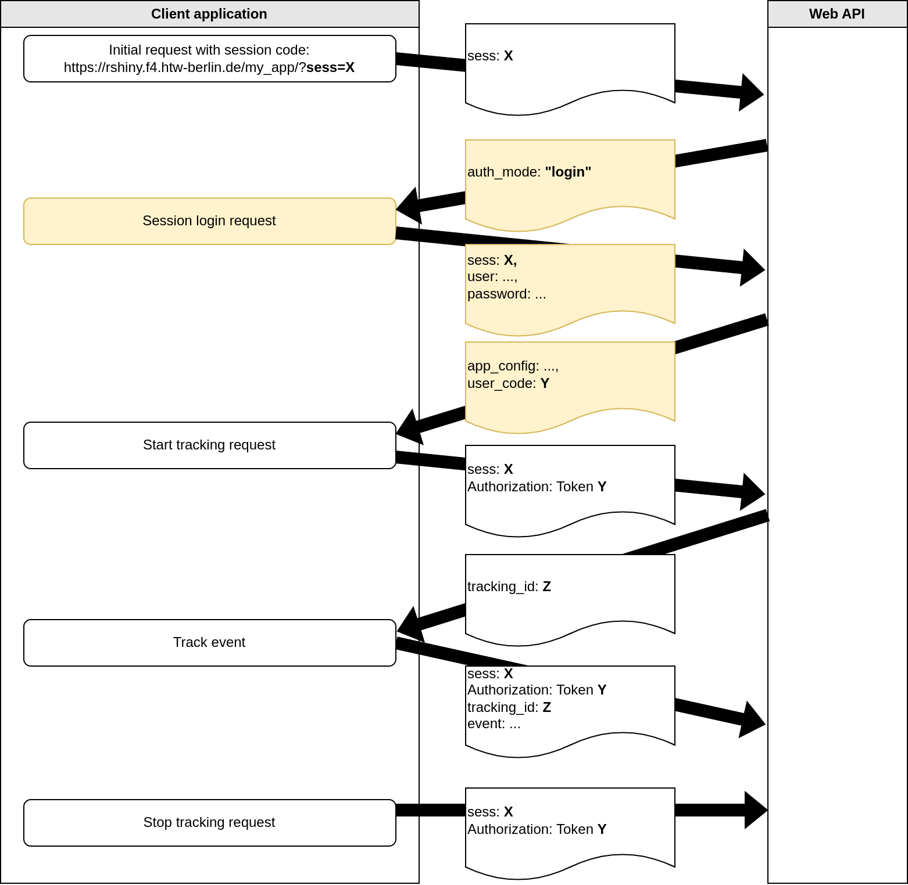

.. _devguide:

Extending the MultiLA software platform
=======================================

This part of the documentation represents the development guide for all components of the MultiLA software platform. The chapter starts with an overview of the components and how they communicate with each other. Then, development and deployment of the different components is discussed.

Overview of the software components
-----------------------------------

The following image show an overview of the MultiLA platform components:

.. image:: img/sw-arch.png
    :width: 100%

- the web API is central and provides a common platform for setting up client applications, configuring and sharing them, and tracking user data and feedback
- all data – user generated or operational – is stored in the database

  - only the web API service has direct access to the database – client applications cannot access the database directly

- for *learnr* and Shiny based client applications, there is a package *learnrextra* that provides all necessary (JavaScript) code to interact with the web API and to make client applications *configurable*

  - this allows to quickly create several client applications that share the same code for interfacing with the web API and that can be configured in some details (e.g. including/excluding certain sections, aesthetic changes, etc.)

- the R Shiny server doesn't communicate with the MultiLA web API, only the JavaScript code on the client side implements the communication
- in general, any (web) application can use the MultiLA web API, which means for example R Shiny applications or Jupyter Notebook applications
- it is possible to connect external services for authentication (e.g. Moodle)

Code repositories overview
^^^^^^^^^^^^^^^^^^^^^^^^^^

- Web API and database: `<https://github.com/IFAFMultiLA/webapi>`_
- *learnrextra* R package: `<https://github.com/IFAFMultiLA/learnrextra>`_
- learning applications (using *learnrextra*):

  - TestgenauigkeitBayes (Bayes' Theorem applied to medical testing): `<https://github.com/IFAFMultiLA/TestgenauigkeitBayes>`_
  - Wahrscheinlichkeitsverteilungen (probability distributions): `<https://github.com/IFAFMultiLA/Wahrscheinlichkeitsverteilungen>`_
  - basic learnrextra test application in RMarkdown/learnr  `<https://github.com/IFAFMultiLA/learnrextra_testapp>`_
  - basic learnrextra test application in Shiny `<https://github.com/IFAFMultiLA/learnrextra_testapp_shiny>`_
  - basic learnr test application with Python `<https://github.com/IFAFMultiLA/learnr_py>`_

- scripts for preparing and analysing collected tracking data: `<https://github.com/IFAFMultiLA/TrackingDataScripts>`_
- this documentation: `<https://github.com/IFAFMultiLA/ifafmultila.github.io>`_

Client-server communication
---------------------------

The client-server communication happens on the basis of a RESTful web API implemented in the `WebAPI repository`_ and the main implementation is in ``api/views.py``. The API exposes an OpenAPI schema under the URL ``http[s]://<HOST>/openapi`` when ``settings.DEBUG`` is ``True``.

Client-server communication flowchart
^^^^^^^^^^^^^^^^^^^^^^^^^^^^^^^^^^^^^

- an application session may either require a login or not – this can be configured in the administration backend for  each application session as "authentication mode"
- all API endpoints except for ``session/`` and ``session_login/`` require an HTTP authorization token, a.k.a "user token", even when no login is required
- this makes sure that each request to the API is linked to a user – either to a registered user (when a login is required) or to an anonymous user that is only identified with a unique code (when no login is required)

Without login ("anonymous"):

- doesn't require an account
- user authentication is based on a user token that is generated on first visit and then stored to cookies for re-use

With login:

- requires that the user has registered an account with email and password

Application configuration
^^^^^^^^^^^^^^^^^^^^^^^^^

- to each application, a configuration can be passed when starting the application session
- the API sends the configuration as JSON object after the initial session request (anonymous session) or after log in (session that requires login) – this is displayed as ``app_config`` key in the above figures
- on the client side, the *learnrextra* R package handles reading the configuration and setting up the application accordingly
- the application configuration JSON object has the following format and options::

    {
      "exclude": [<HTML element IDs to exclude>],
      "js": [<additional JavaScript files to load>],
      "css": [<additional CSS files to load>],
      "feedback": <bool>, # enable/disable specific user feedback features
      "summary": <bool>,  # enable/disable displaying summary
      "tracking": {       # enable/disable specific tracking features
        "mouse": <bool>,    # mouse tracking w/ mus.js
        "inputs": <bool>,   # tracking of input changes
        "attribute_changes": <bool>,  # tracking of attribute changes
        "chapters": <bool>  # tracking of switching betw. chapters
      }
    }
