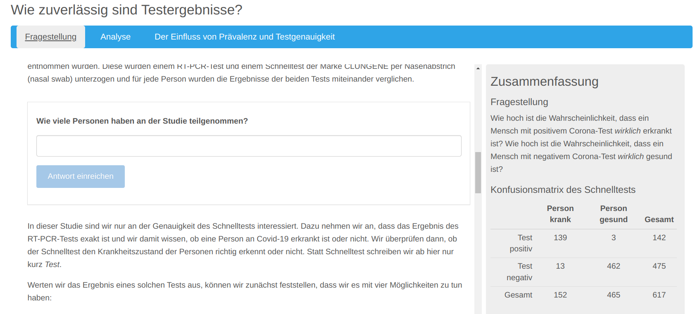

.. _learning_apps:

Creating learning applications
==============================

The *MultiLA* software platform authoring tool is based on an extension for the R package `learnr`_. This extension is called `learnrextra`_ and is so far not available on CRAN, but can be installed via GitHub (see instructions below). Writing learning applications or tutorials works the same as with learnr, but learnrextra provides some additional features which will be explained below.

Installation
------------

**Basic requirements:** You should have R and RStudio installed.

1. (optional) Create a new RStudio project with `renv`_ for each new learning application.
2. Install the `learnrextra`_ package from GitHub, e.g. via ``renv::install("https://github.com/IFAFMultiLA/learnrextra")``.
3. Install the `gradethis`_ package from GitHub, e.g. via ``renv::install("https://github.com/rstudio/gradethis")``.
4. Restart RStudio (unfortunately this is needed by RStudio in order to load the installed templates required for the next step).
5. Create an RMarkdown document via *File > New file > RMarkdown document ...* and select *From template > Interactive tutorial (learnrextra)*.
6. Optionally update the language in the markdown *frontmatter* (header).
7. Check that generating ("knitting") the document works by clicking "Run document".

You can find a minimal RMarkdown-based learning application in the `learnrextra_testapp <https://github.com/IFAFMultiLA/learnrextra_testapp>`_ repository.

Note that it is also possible to use the tracking functionality of *learnrextra* in a standard R `Shiny`_ application. For this to work, you only need to load the learnrextra package and call ``use_learnrextra()`` in the UI code of your app. See the `learnrextra_testapp_shiny <https://github.com/IFAFMultiLA/learnrextra_testapp_shiny>`_ repository for a minimal Shiny application with learnrextra.

Usage
-----

You can now create your learning application in RMarkdown syntax. See the `learnr`_ documentation for how to do that. You will learn there how to add text, figures, interactive illustrations, equations, code exercises, quiz questions, videos and more to your learning application.

Frontmatter options
^^^^^^^^^^^^^^^^^^^

.. note:: *Frontmatter* is the initial header block in Markdown documents denoted by beginning and trailing separator lines "``---``".

For a learnrextra based learning application, the "output" option in the frontmatter of your RMarkdown should be set to ``learnrextra::tutorial`` (as it is set by default in the template):

.. code-block:: yaml

    # ...
    output:
        learnrextra::tutorial:
            language: en
            apiserver: http://localhost:8000/
    # ...

There are two options for this output type:

- ``language`` is an ISO-639 two-letter language code for the language used in the learning application and sets the language of the learning application interface.
- ``apiserver`` is the endpoint of the web API used to collect the tracking data; by default it's set to send to port 8000 on localhost, e.g. on a local development machine; the following chapter will explain more about this.

Furthermore you should add the follwing line to the initial R *setup* code chunk (as it is also set by default in the template):

.. code-block:: r

    rmarkdown::find_pandoc(cache = FALSE)

This makes sure that when deploying your app on a server, the server's installation of pandoc will be used for compiling your app instead of the outdated version that is provided internally by Shiny.

Dynamic summary syntax
^^^^^^^^^^^^^^^^^^^^^^

An advanced feature of learnrextra is the *dynamic summary panel:* While working through the learning application, summarized content can be shown dynamically on a panel in the right side, depending on the learning progress. The summary pnael is shown in the following screenshot on the right side:

To add dynamic summary content in your learning application, insert a "fenced div" block named ``summary`` at the position where the summary should be shown when the user has scrolled past it:

.. code-block:: markdown

    ::: summary

    #### Example headline

    Initial content underneath this headline.

    :::

It's important to structure summary content with level-4 headlines (``#### (headline)``). If you place another ``summary`` block somewhere in your document with the same headline, new content will automatically be added underneath that headline:

.. code-block:: markdown

    ::: summary

    #### Example headline

    Additional content underneath this headline.

    :::

If you add ``{.replace}`` behind the headline, this will cause to completely replace the content underneath that headline:

.. code-block:: markdown

    ::: summary

    #### Example headline {.replace}

    Replaced content underneath this headline.

    :::

Deployment
----------

The learning applications can be hosted on any R `Shiny`_ server. The next chapter on ":doc:`serversetup`" will give more information on deploying learning applications within the MultiLA software platform.
