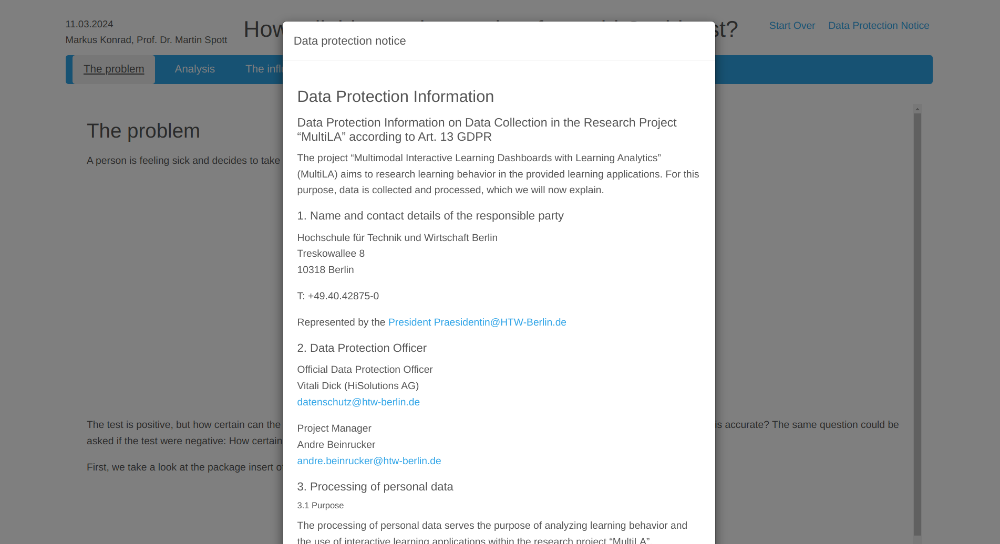

.. _learning_apps:

Creating learning applications
==============================

The *MultiLA* software platform authoring tool is based on an extension for the R package `learnr`_. This extension is called `learnrextra`_ and is so far not available on CRAN, but can be installed via GitHub (see instructions below). Writing learning applications or tutorials works the same as with learnr, but learnrextra provides some additional features which will be explained below.

.. note::

    It's also possible to use `learnrextra`_ in standard Shiny applications and hence allow to enable the tracking features in those applications. See the ":ref:`learnrextra_in_shiny`" section below.

Installation
------------

**Basic requirements:** You should have R and RStudio installed.

.. important:: You should also have a recent version of `pandoc <https://pandoc.org/>`_ installed on your system (e.g. via `sudo apt install pandoc` on Debian or Ubuntu based Linux systems).

1. (optional) Create a new RStudio project with `renv`_ for each new learning application.
2. Install the `learnrextra`_ package from GitHub, e.g. via ``renv::install("https://github.com/IFAFMultiLA/learnrextra")`` or from a local folder if you've cloned the repository (``renv::install("<LOCAL PATH TO REPOSITORY>")``).
3. (optional) Install the `gradethis`_ package from GitHub, e.g. via ``renv::install("https://github.com/rstudio/gradethis")`` if you want to use code exercises and check them.
4. Restart RStudio (unfortunately this is needed by RStudio in order to load the installed templates required for the next step).

You can now either create an RMarkdown-based application (a learnr app) or a Shiny-based application. For the former, continue with the following steps. For the latter, read on in the ":ref:`learnrextra_in_shiny`" section.

1. Create an RMarkdown document via *File > New file > RMarkdown document ...* and select *From template > Interactive tutorial (learnrextra)*.
2. Optionally update the language in the markdown *frontmatter* (header).
3. Check that generating ("knitting") the document works by clicking "Run document".

Usage in RMarkdown-based applications (learnr apps)
---------------------------------------------------

You can now create your learning application in RMarkdown syntax. See the `learnr`_ documentation for how to do that. You will learn there how to add text, figures, interactive illustrations, equations, code exercises, quiz questions, videos and more to your learning application.

You can find a minimal RMarkdown-based learning application for illustrative purposes in the `learnrextra_testapp <https://github.com/IFAFMultiLA/learnrextra_testapp>`_ repository.

.. _learning_apps_frontmatter:

Frontmatter options
^^^^^^^^^^^^^^^^^^^

.. note:: *Frontmatter* is the initial header block in Markdown documents denoted by beginning and trailing separator lines "``---``".

For a learnrextra based learning application, the "output" option in the frontmatter of your RMarkdown should be set to ``learnrextra::tutorial`` (as it is set by default in the template):

.. code-block:: yaml

    # ...
    output:
        learnrextra::tutorial:
            language: en
            apiserver: http://localhost:8000/
    # ...

There are two options for this output type:

- Option ``language`` is an ISO-639 two-letter language code for the language used in the learning application and sets the language of the learning application interface. ``learnr`` supports many languages but ``learnrextra`` at the moment only supports English (``en``) and German (``de``). The elements of the interface that are provided by ``learnrextra`` will be in English by default, if you use any other language than German.
- Option ``apiserver`` is the endpoint of the web API used to collect the tracking data; by default it's set to send to port 8000 on localhost, e.g. on a local development machine. The following chapter will explain more about this.

Furthermore you should add the follwing line to the initial R *setup* code chunk (as it is also set by default in the template):

.. code-block:: r

    rmarkdown::find_pandoc(cache = FALSE)

This makes sure that when deploying your app on a server, the server's installation of pandoc will be used for compiling your app instead of the outdated version that is provided internally by Shiny.

Dynamic summary syntax
^^^^^^^^^^^^^^^^^^^^^^

An advanced feature of learnrextra is the *dynamic summary panel:* While working through the learning application, summarized content can be shown dynamically on a panel in the right side, depending on the learning progress. The summary pnael is shown in the following screenshot on the right side:

.. image:: img/learningapp_summary.png
    :align: center
    :width: 100%

To add dynamic summary content in your learning application, insert a "fenced div" block named ``summary`` at the position where the summary should be shown when the user has scrolled past it:

.. code-block:: markdown

    ::: summary

    #### Example headline

    Initial content underneath this headline.

    :::

It's important to structure summary content with level-4 headlines (``#### (headline)``). If you place another ``summary`` block somewhere in your document with the same headline, new content will automatically be added underneath that headline:


.. code-block:: markdown

    ::: summary

    #### Example headline

    Additional content underneath this headline.

    :::

If you add ``{.replace}`` behind the headline, this will cause to completely replace the content underneath that headline:

.. code-block:: markdown

    ::: summary

    #### Example headline {.replace}

    Replaced content underneath this headline.

    :::

.. _embed_surveys:

User feedback and surveys
^^^^^^^^^^^^^^^^^^^^^^^^^

When employing learning analytics with your learning application, embedding survey questions may be necessary. The learnrextra package provides a simple user feedback system that is displayed by default at the end of each chapter and includes a five-star rating and a free text field. For specific survey questions however, you can repurpose learnr's quiz questions by marking all answers as "correct" as shown in the following example:

.. code-block::

    ```{r survey_choices_example}
    question("Did you like this learning application?",
      answer("y", label = "Yes.", correct = TRUE),
      answer("n", label = "No.", correct = TRUE),
      answer("dk", label = "Don't know.", correct = TRUE),
      type = "learnr_radio",   # force to use radio choice inputs
      allow_retry = FALSE,
      correct = "Thanks."
    )
    ```

    ```{r survey_freetext}
    question_text("What would you improve in the learning application?",
      answer_fn(correct, label = "survey_freeform"),
      allow_retry = FALSE,
      correct = "Thanks."
    )
    ```

In the tracking data, the provided answers will show up with the event type ``learnr_event_question_submission`` and the respective code chunk label.

Future versions of learnrextra may provide a more convenient way to specify surveys.

.. _embed_dataprotection_trackingconsent:

Data protection and tracking consent notes
^^^^^^^^^^^^^^^^^^^^^^^^^^^^^^^^^^^^^^^^^^

You should embed the relevant text for the data protection and tracking consent notes in your learning application. To do so, place them within a ``tracking_consent_text`` and ``data_protection_text`` block, respectively. You can use any Markdown or HTML formatting.

.. code-block:: markdown

    ::: tracking_consent_text

    <place tracking consent notes here>

    :::

    ::: data_protection_text

    <place data protection notes here>

    :::

You can make the tracking consent information adaptive depending on the tracking configuration. By this, only the items that are actually being recording will also be displayed in the tracking consent information:

.. code-block:: markdown

    ::: tracking_consent_text

    [ ... more text ... ]

    The recorded data include the following information:

    <ul>
        <li>Start and end time of the website usage</li>
        <li class="trackingdata-ip">IP address</li>
        <li class="trackingdata-user_agent">Browser software</li>
        <li class="trackingdata-device_info">Device type and browser window size</li>
        <li class="trackingdata-visibility">Display status of the browser window</li>
        <li class="trackingdata-mouse">Mouse movements</li>
        <li class="trackingdata-clicks">Clicks or taps</li>
        <li class="trackingdata-scrolling">Scroll movements</li>
        <li class="trackingdata-inputs">Changes to control elements (for interactive graphics, etc.)</li>
        <li class="trackingdata-attribute_changes">Changes to HTML elements</li>
        <li class="trackingdata-chapters">Information about page transitions</li>
        <li class="trackingdata-summary">Display and update of the summary bar</li>
        <li class="trackingdata-exercise_hint">Information while filling out code tasks (display of the hint)</li>
        <li class="trackingdata-exercise_submitted">Information while filling out code tasks (submission)</li>
        <li class="trackingdata-exercise_result">Information while filling out code tasks (result)</li>
        <li class="trackingdata-question_submission">Information while filling out quizzes (given answers, result)</li>
        <li class="trackingdata-video_progress">Information about video playback</li>
    </ul>

    [ ... more text ... ]

    :::

The data protection and tracking consent notes will be displayed as modal dialogs as for example shown in this image:



.. _learnrextra_in_shiny:

Usage in Shiny applications
---------------------------

If you want to develop a learning application using Shiny instead of RMarkdown, you can also use the `learnrextra`_ package to enable user interaction tracking. You need to load the library in your ``app.R`` file, set the URL for the API server and optionally set the language:

.. code-block:: r

    library(learnrextra)

    options("learnrextra.apiserver" = "http://localhost:8000")
    options("learnrextra.language" = "en")

Then, simply use the ``use_learnrextra()`` library in your UI code to enable it. You can optionally pass paths to HTML snippets for the tracking consent and data protection notes via the ``consentmodal`` and ``dataprotectmodal`` parameters. These paths must be relative to your Shiny project path. See `trackingconsent.html <https://github.com/IFAFMultiLA/learnrextra_testapp_shiny/blob/main/www/trackingconsent.html>`_ and `dataprotect.html <https://github.com/IFAFMultiLA/learnrextra_testapp_shiny/blob/main/www/dataprotect.html>`_ for how the HTML snippets should be structured. In order to show a field with the link to the data protection notes and optional login information, you should use the ``info_display()`` function in your UI code. An example for the UI code looks like this:

.. code-block:: r

    ui <- fluidPage(
        # set up learnrextra; optionally point to HTML files with tracking consent and data protection notes
        use_learnrextra(consentmodal = "www/trackingconsent.html", dataprotectmodal = "www/dataprotect.html"),

        fluidRow(
            column(
                width = 12,
                info_display()   # show link for data protection and optional login information
            )
        ),

        # ... all other UI code
    )


See also the `learnrextra_testapp_shiny <https://github.com/IFAFMultiLA/learnrextra_testapp_shiny>`_ repository for a minimal Shiny application with learnrextra.


Deployment
----------

The learning applications can be hosted on any R `Shiny`_ server. The next chapter on ":doc:`serversetup`" will give more information on deploying learning applications within the MultiLA software platform.
