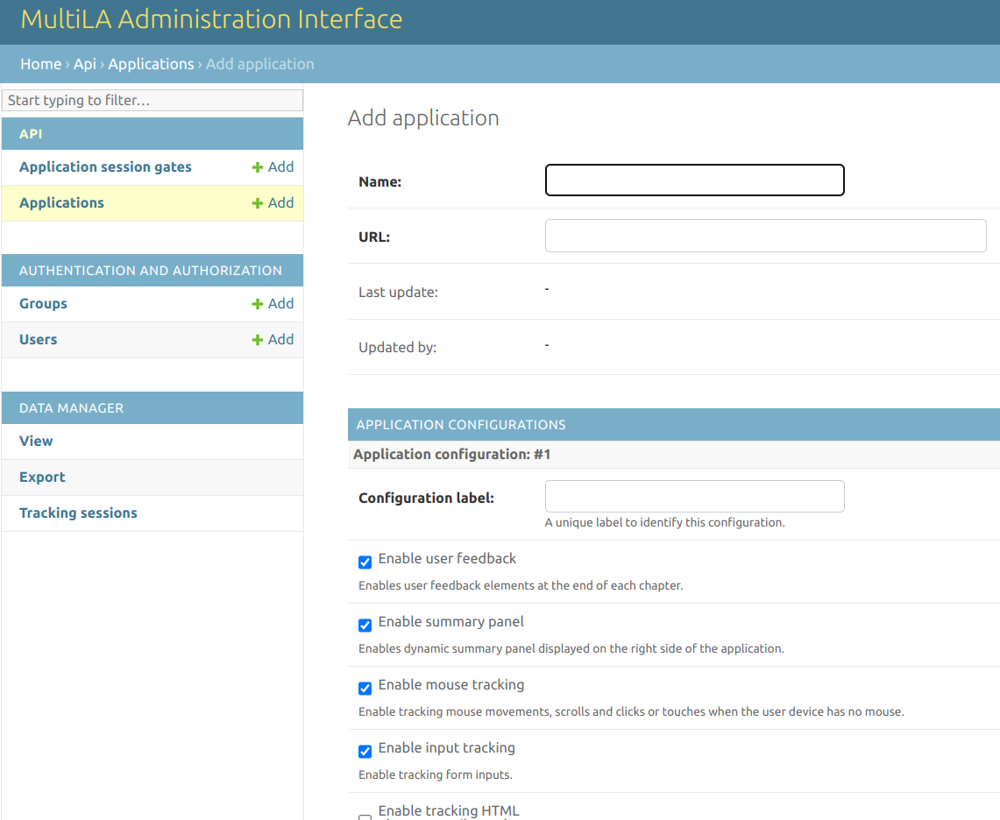
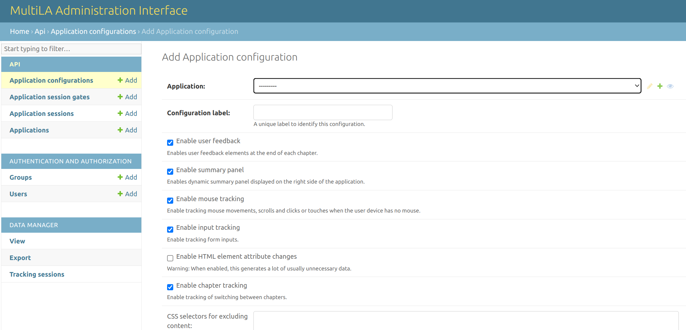
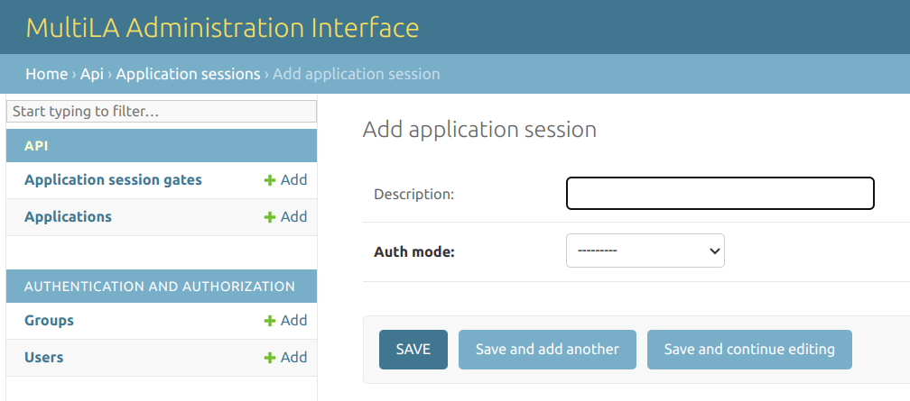
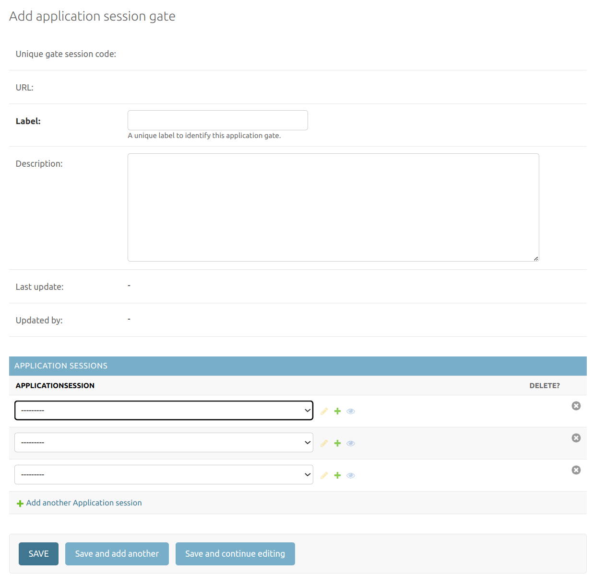
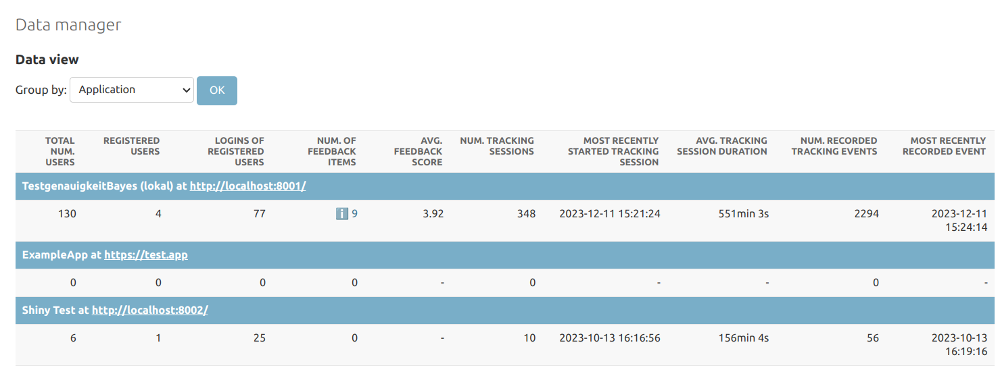
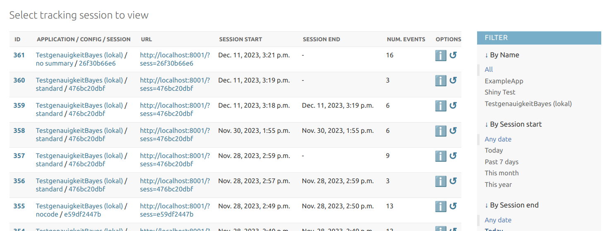
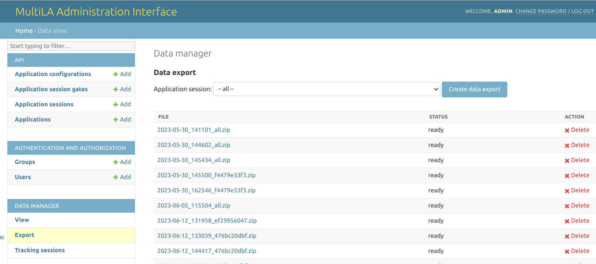

.. _tracking_data:

Working with tracking data
==========================

Setting up a learning application for tracking
----------------------------------------------

In the chapter ":doc:`serversetup`", you set up a server with the web API that acts as endpoint at ``https://<SERVER>/api/`` for collecting the tracking data that comes from the learning applications. For each application that you deploy, you need to set this endpoint in the frontmatter options of its RMarkdown file under ``apiserver``, e.g.:

.. code-block:: yaml

    # ...
    output:
        learnrextra::tutorial:
            language: en
            apiserver: https://<SERVER>/api/
    # ...

This will make sure that the deployed learning applications know where to send the collected data.

Registering a learning application with the MultiLA administration backend
--------------------------------------------------------------------------

Each learning application for which you want to collect tracking data is required to be registered in the administration interface that is available under ``https://<SERVER>/api/admin/`` after you installed it on a server as explained in chapter ":doc:`serversetup`".

After logging in to the administration interface, go to *API > Applications* and select *Add application*. You will see a form as follows:

Give the new learning application a name and most importantly, enter the full URL under which it is available, e.g. ``https://<SERVER>/myapp/``.

For each learning application, you can create several *application configuration.* These allow you to create different variants of the same base application. You need to at least create one default configuration, so go to *API > Application configurations > Add*. You will see the following form:

First, select the application for which you want to create a configuration. Next, create a label and optionally modify the default configuration code. The configuration code is a JSON structure with the following options:

.. code-block::

    {
      "exclude": [<HTML element IDs to exclude>],
      "js": [<additional JavaScript files to load>],
      "css": [<additional CSS files to load>],
      "feedback": <bool>, # enable/disable specific user feedback features
      "summary": <bool>,  # enable/disable displaying summary
      "tracking": {       # enable/disable specific tracking features
        "mouse": <bool>,    # mouse tracking w/ mus.js
        "inputs": <bool>,   # tracking of input changes
        "attribute_changes": <bool>,  # tracking of attribute changes
        "chapters": <bool>  # tracking of switching betw. chapters
      }
    }

After you created one or more application configurations, you finally have to create at least one *application session.* An application session is an instance of your configured learning application for which you collect tracking data. Each application session will receive a unique session ID and therefore a unique URL that you can share. To create an application session, go to *API > Application sessions > Add* and you will be presented the following form:

Select the application configuration (and hence the target learning application) and specify whether users should need to authenticate via login. Note that the authentication mode is very minimal: it only consists of a user name and password (no user email or other data). It's main purpose is to allow tracking users across different devices and time distinct user sessions. If you don't need that, you should disable user authentication.

.. note:: This hierarchy of *applications → application configurations → application sessions* allows to create several variants of a single learning application (e.g. for A/B testing – see below) and furthermore allows to bind tracking to specific events, e.g. by creating a session for a specific teaching course or workshop. You will then later be able to download and analyse data for these specific application sessions.

After saving, a unique session ID will be created along with a shareable URL that has the format ``https://<SERVER>/myapp/?sess=<UNIQUE_ID>``, as you can also see in the following screenshot:

The URL is very important: If visiting this URL and consenting to data collection, a *tracking session* will be created for the user and tracking data will be collected as configured in the application configuration while the user interacts with the learning application. This tracking data will be associated with the application session that corresponds to the unique session ID.

Note that it is also possible to set a "default application session." This means that every time someone visits the learning application under its base URL ``https://<SERVER>/myapp/``, the collected data will be automatically associated with the default application session. If no default application session is set, a user will either be forwared to the last application session she or he visited for that application or otherwise tracking will either be disabled. You can set a default application session under *API > Applications.*

(Optional) Creating application sessions gates for A/B tests
------------------------------------------------------------

If you want to use the MultiLA platform to do A/B testing for your learning applications, you can use the *application session gates* feature. First, create two or more application sessions (for different learning applications or different configurations for the same application). Then, got to *API > Application session gates > Add* and you will be presented the following form:

Enter a label to identify the gate and select two or more application sessions at the bottom of the form. After saving the form, a unique *gate ID* will be generated along with an URL. Every visit to that URL will forward the user to one of the application sessions in an alternating manner (i.e. sessions A / B / C / A / B / C / ... if you have added three sessions to the gate).

Monitoring user tracking
------------------------

You can monitor the collection of live tracking and user feedback data. An overview of currently collected data is presented under *Data manager > View:*

This overview gives some basic descriptive statistics of the collected data per application, application configuration or application session. By clicking on the small "info" icon in the *Num. of feedback items* column, you can view the user feedback for a given application, application configuration or application session.

You can watch live tracking data by visiting *Data maanger > Tracking sessions.* This will list all *tracking sessions* for which data is or was being collected.

.. note:: A *tracking session* is a time frame of interaction with a learning application that can be attributed to a single user. If a user visits an application session URL, a new tracking session is started if the user gave consent to tracking and if the user doesn't already have a running tracking session for that application sessions (this is determined via browser cookies). If the user already has a running tracking session for that application session (e.g. by coming back to the page after restarting the browser), this tracking session is continued and all new tracking data is added to the already existing data in the tracking session.

The tracking sessions overview will present you a table like this:

The newest tracking session is by default shown on top. Session start and end give the time frame of the tracking session. If there's no end time, this means that the tracking session is either currently running or that no tracking session end time could be determined (this may happen if the user's browser for some reason doesn't send a signal when closing the page).

The *Options* column allows you to see details of the tracking session and the collected data by clicking on the "info" icon. The circular arrow icon allows you to replay tracking session, i.e. to view the sequence of interactions that the user had with the learning applications like a video. Note that this feature currently doesn't always work as expected.

Downloading and preparing tracking data for analysis
----------------------------------------------------

Downloading the tracking data
^^^^^^^^^^^^^^^^^^^^^^^^^^^^^

You can navigate to *Data manager > Export* in order to generate a ZIP file with the collected tracking data.

You can select which for which application session you want to create a data export or choose to create a data export for all application sessions (which is not recommended as it may create a very large file and take a long to time generate the data export). The generated ZIP file will then be listed in the table below. Once it is ready, you can download it to your computer. The ZIP file contains a PDF with a codebook and four CSV files with the data. The codebook explains the structure of the data in detail. It is also contained in this documentation's appendix under ":doc:`codebook_raw_data`."

Preparing the tracking data for analysis
^^^^^^^^^^^^^^^^^^^^^^^^^^^^^^^^^^^^^^^^

The MultiLA project provides R scripts to transform the complex raw tracking data to a flat data frame that is better suited for further data analyses. These scripts are part of the `TrackingDataScripts`_ repository. You should clone or download the repository. The unzipped CSV files with the collected data should then be placed under ``data/raw/<application_session_id>/``. It should contain four CSV files: ``app_sessions.csv``, ``tracking_events.csv``, ``tracking_sessions.csv`` and ``user_feedback.csv``.

Next, run ``prepare.R``. This will transform the raw data for all application sessions in ``data/raw`` to a flat data frame which is in detail described on the repository's README page or in the appendix under ":doc:`codebook_prepared_data`." The resulting data will be located at ``data/prepared/<application_session_id>_tracking_data.rds``.

Descriptive and explorative analysis of tracking data
-----------------------------------------------------

The `TrackingDataScripts`_ repository also contains functions to aid descriptive and explorative analyses of the prepared tracking data. See the file ``analysis_helpers.R`` there and the analysis reports in RMarkdown format.
